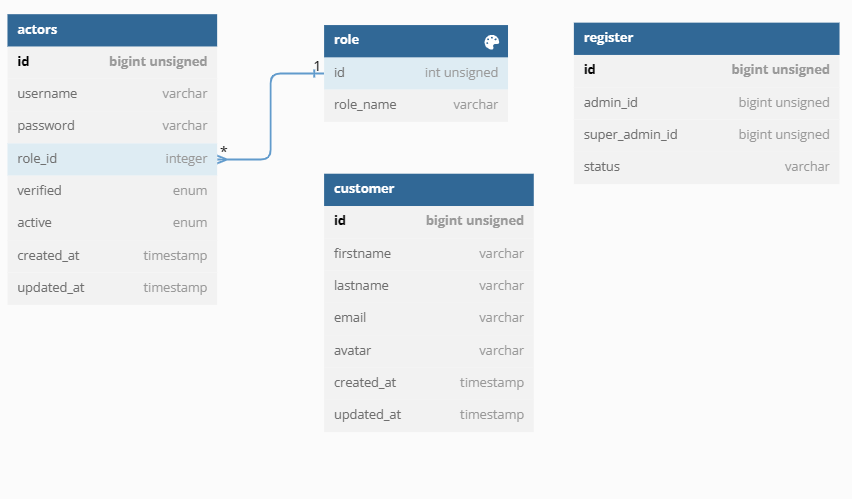

# MINI PROJECT 3 CRM SERVICE

## 

1* Link API postman [postman](https://www.postman.com/flight-architect-83391395/workspace/miniproject3/request/18859057-409f7d07-8b49-4611-b990-396454ec1558)


```
2*. Run to download go package 
```
   go mod download 
   
```
3*. Run test
```
go test ./...
```
4*. Run program
```
go run main.go
```

## Run Project with Docker-compose

1. Run Build Docker-Compose
```
docker-compose build
```
2. Run Docker-Compose
```

```
docker-compose up -d
```


### ERD DATABASES
